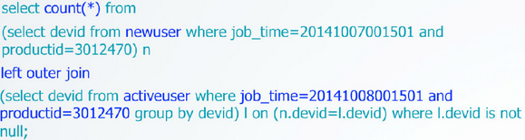

#bitmap的秘密

##1 简介

bitmap是一种非常节省内存的数据结构，因为其最小存储单位是bit，每位上的值可以是0或者1。 bitmap可以看成是bit数组。例如一个公司有8名员工，那么只需8位的bitmap就可以记录当天的出勤情况。  

所以，bitmap可节省大量内存，极易运算(AND/OR/XOR/NOT)。例如，如果要查看那个员工连续两天缺勤，则可以通过or运算：  
</img>  
再比如我们如果还想知道哪些男员工没来，则只需要再AND一个bitmap即可。

##2 bitmap的压缩
bitmap常见的压缩是基于RLE([Run Length Encoding](https://en.wikipedia.org/wiki/Run-length_encoding))。例如：
</img>  
可以编码为：0,8,2,11,1,2,3,11。其意思是:第一位为0，连续有8个，接下来是2个1，11个0，1个1，2个0，3个1，最后是11个0（当然此处只是对RLE的基本原理解释，实际应用中的编码并不完全是这样的）。可以预见，对于一个很大的Bitmap，如果里边的数据分布很稀疏（说明有很多大片连续的0），采用RLE编码后，占用的空间会比原始的Bitmap小很多。

同时引入一些对齐的技术，可以让采用RLE编码的Bitmap不需要进行解压缩，就可以直接进行AND/OR/XOR等各类计算；因此采用这类压缩技术的Bitmap文件，加载到内存后还是以压缩的方式存在，从而可以保证计算时候的低内存消耗；而采用word（计算机的字长，64位系统就是64bit）对齐等技术又保证了对CPU资源的高效利用。因此采用这类压缩技术的Bitmap，保持了Bitmap数据结构最重要的一个特性，就是高效的针对每个bit的逻辑运算。

常见的压缩技术包括BBC(有专利保护):
WAH（http://code.google.com/p/compressedbitset/）
和EWAH(http://code.google.com/p/javaewah/)。在Apache Hive里边使用了EWAH。

##2 bitmap在大数据中应用
例如我们如果想完成用户回访的统计，比如某个应用，昨天新增的用户中，有多少人今天又开启了应用(次日留存)。

如果用hive，则需要下面的语句：
</img>  
但是，如果用bitmap来实现，查询效率就会集聚提高。
</img>

