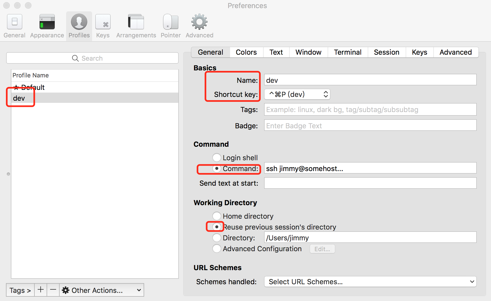

#Iterm2设置
#1 登录远程服务器
进入iterm2的preference，增加机器


#2 免密码
```
vi ~/.ssh/config
host *
ControlMaster auto
ControlPath ~/.ssh/master-%r@%h:%p
```
可参考ttp://linux.die.net/man/5/ssh_config。
在~/.ssh/下会生成master-*的sock文件，记录目前登陆的机器，第一次登陆需要输入密码，后面登陆或者类似clone session，都无需输入密码。
卡住时，解决办法：在自动登录脚本中，把输入密码的那两行去掉，即可！

